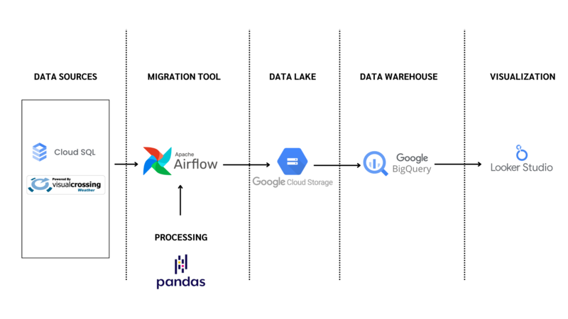

# Ride Weather Pipeline

This project is an ETL (Extract, Transform, Load) pipeline designed to fetch, merge, and process bike trip data from a MySQL database and weather data from the Visual Crossing API. The processed data is then loaded into Google BigQuery for further analysis and visualization.

## Table of Contents
- [Project Overview](#project-overview)
- [Data Pipeline Overview](#data_pipeline_overview)
- [Technologies Used](#technologies-used)
- [Project Structure](#project-structure)
- [Setup and Installation](#setup-and-installation)
- [How It Works](#how-it-works)
- [DAG Workflow](#dag-workflow)
- [Environment Variables](#environment-variables)
- [Contributing](#contributing)
- [License](#license)
- [Contact](#contact)

## Project Overview
The goal of this project is to automate the process of extracting bike trip data from a MySQL database, fetching weather data from an external API, merging the two datasets, and loading the final dataset into Google BigQuery. The pipeline is orchestrated using Apache Airflow, and the data is stored in Google Cloud Storage (GCS) before being loaded into BigQuery.

## Data Pipeline Overview
This diagram illustrates the data processing flow:



## Technologies Used
- **Apache Airflow**: For orchestrating the ETL pipeline.
- **Python**: For data processing and scripting.
- **Pandas**: For data manipulation and transformation.
- **MySQL**: For storing bike trip data.
- **Visual Crossing API**: For fetching weather data.
- **Google Cloud Platform (GCP)**:
  - **Google Cloud Storage (GCS)**: For storing intermediate data files.
  - **BigQuery**: For storing the final merged dataset.
- **Docker**: For containerization (if applicable).

## Project Structure
```
bike-weather-pipeline/
├── dags/
│   └── bike_weather_dag.py       # Airflow DAG definition
├── data/                         # Directory for storing intermediate data files
├── README.md                     # Project documentation
├── requirements.txt              # Python dependencies
└── .gitignore                    # Files and directories to ignore in Git
```

## Setup and Installation

### Prerequisites
- **Apache Airflow**: Ensure Airflow is installed and running.
- **Google Cloud Platform (GCP)**:
  - Create a GCP project.
  - Enable Google Cloud Storage and BigQuery APIs.
  - Set up a service account with the necessary permissions and download the credentials JSON file.
- **MySQL Database**: Ensure you have access to a MySQL database with the required tables (`trips`, `users`, `stations`).
- **Visual Crossing API Key**: Obtain an API key from Visual Crossing.

### Installation Steps
Clone the repository:
```bash
git clone https://github.com/KateJeeranan/Ride_Weather_Pipeline.git
cd Ride_Weather_Pipeline
```

Install Python dependencies:
```bash
pip install -r requirements.txt
```

Set up environment variables:
Create a `.env` file in the root directory and add the following variables:
```plaintext
WEATHER_API_KEY=your_visual_crossing_api_key
GCS_BUCKET_NAME=your_gcs_bucket_name
GCP_PROJECT_ID=your_gcp_project_id
BQ_DATASET=your_bigquery_dataset
BQ_TABLE=your_bigquery_table
MYSQL_CONNECTION=mysql_default
```

Configure Airflow connections:
- Set up a MySQL connection in Airflow with the ID `mysql_default`.
- Set up a Google Cloud connection in Airflow with the necessary credentials.

Deploy the DAG to Airflow:
- Place the `bike_weather_dag.py` file in the `dags/` directory of your Airflow installation.

## How It Works
### Extract:
- Bike trip data is fetched from a MySQL database.
- Weather data is fetched from the Visual Crossing API.

### Transform:
- The bike trip data is merged with user and station data.
- The weather data is cleaned and transformed.
- The two datasets are merged based on the trip start date and weather date.

### Load:
- The final merged dataset is saved as a Parquet file in Google Cloud Storage.
- The Parquet file is loaded into Google BigQuery for further analysis.

## DAG Workflow
The Airflow DAG consists of the following tasks:

1. **Fetch and Merge Data from MySQL**:
   - Extracts bike trip data from MySQL and merges it with user and station data.
   - Saves the merged data as Parquet files.

2. **Fetch Weather Data**:
   - Fetches weather data from the Visual Crossing API.
   - Saves the weather data as a Parquet file.

3. **Merge Trip and Weather Data**:
   - Merges the bike trip data with the weather data.
   - Saves the final merged dataset as a Parquet file.

4. **Load Data into BigQuery**:
   - Loads the final merged dataset from GCS into BigQuery.

## Environment Variables
The following environment variables are required for the pipeline to run:

| Variable Name      | Description                                  |
|-------------------|----------------------------------------------|
| `WEATHER_API_KEY` | API key for the Visual Crossing API.         |
| `GCS_BUCKET_NAME` | Name of the Google Cloud Storage bucket.     |
| `GCP_PROJECT_ID`  | ID of the Google Cloud project.              |
| `BQ_DATASET`      | Name of the BigQuery dataset.                |
| `BQ_TABLE`        | Name of the BigQuery table.                  |
| `MYSQL_CONNECTION`| Airflow connection ID for MySQL.             |

## Contributing
Contributions are welcome! If you'd like to contribute to this project, please follow these steps:

1. Fork the repository.
2. Create a new branch (`git checkout -b feature/YourFeatureName`).
3. Commit your changes (`git commit -m 'Add some feature'`).
4. Push to the branch (`git push origin feature/YourFeatureName`).
5. Open a pull request.

## License
This project is licensed under the MIT License. See the `LICENSE` file for details.

## Contact
For any questions or feedback, please contact:

**Jeeranan Prakothan**  
📧 Email: jeeranan.prak@gmail.com  
🐙 GitHub: [KateJeeranan](https://github.com/KateJeeranan)

